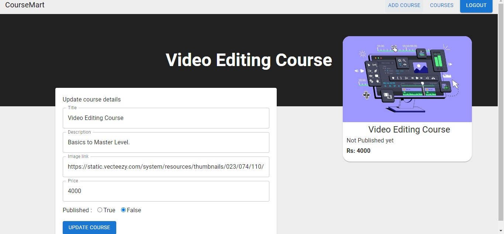

# Course Mart

This project is a full-stack course management platform that provides separate dashboards for admins and users. Admins can create, update, delete, and publish courses, while users can browse and purchase published courses. The platform is equipped with authentication for both users and admins.

- [Live Demo](https://course-mart-frontend.vercel.app)

## Table of Contents

- [Demo Images](#demo-images)
- [Features](#features)
- [Usage](#usage)
- [Technologies Used](#technologies-used)
- [Prerequisities](#prerequisites)
- [Setup and Installation](#setup-and-installation)
- [Environment Variables](#environment-variables)
- [API Endpoints](#api-endpoints)

## Demo Images

**Landing Page**


**Registration Page**


**Courses created by admin Page**


**Update Course Page**



**Published Courses Page**


## Features

- **Admin Dashboard:** Create, update, delete, and publish courses.
- **User Dashboard:** Browse, view and buy published courses.
- **Authentication:** Secure login with JSON Web Tokens (JWT) and session management, allowing access for one hour.
- **User Interface:** Interactive and user-friendly frontend built with React and Material-UI.
- **API Testing:** APIs tested using Postman.
- **State Management:** Efficient state management using Recoil.

## Usage

### Accessing the Application

- **Frontend:** Open your web browser and navigate to [http://localhost:5173].
- **Backend:** The backend API will be running at [http://localhost:3000].
- Register with username and password if registered already login and you are good to go.

## Technologies Used

### Backend

- **Express.js**: A minimal and flexible Node.js web application framework that provides a robust set of features for building web and mobile applications. It is used to create the backend server and handle API routes.
- **MongoDB:** NoSQL database for storing user data and book information.
- **Postman:** API testing and documentation tool.
- **JSON Web Tokens (JWT):** Used for secure authentication.

### Frontend

- **React:** JavaScript library for building user interfaces.
- **Recoil:** State management library for React applications.
- **Material-UI:** React component library for implementing Google's Material Design.

### Additional Tools

- **Git:** Version control system for tracking changes and collaborating with others.
- **GitHub:** Hosting service for version control using Git.
- **Visual Studio Code:** For developing MERN web application.
- **Vercel**: The entire application (both frontend and backend) is deployed on Vercel, which handles the hosting and continuous deployment of the application.[Live Demo](https://course-mart-frontend.vercel.app)

## Prerequisites

Before you begin to setup locally, ensure you have met the following requirements:

- Node.js and npm (Node Package Manager) installed for frontend and backend dependencies.
- Git for cloning the repository.

## Setup and Installation

Follow these steps to get the project up and running on your local machine:

### Backend (Express)

1. Clone the repository:
   ```
     git clone https://github.com/Faizaan2003/Course_Mart.git
   ```
2. Navigate to the backend directory:
   ```
     cd server
   ```
3. Install dependencies:
   ```
     npm install
   ```
4. Run the Express application:
   ```
     node index.js
   ```

The backend server will start running at http://localhost:3000

### Frontend (React Application)

1. Navigate to the frontend directory:
   ```
     cd ../admin-client
   ```
2. Install dependencies:
   ```
     npm install
   ```
3. Start the React development server:
   ```
     npm run dev
   ```

The frontend server will start running at http://localhost:5173.

## Environment Variables

Create a `.env` file in the server directory and add the following environment variables:

```
  MONGODB_URI=your_mongo_connection_string
  secret=your_jwt_secret_key
```

## API Endpoints

The available API endpoints and their usage, such as:

### Admin Routes

- **POST /admin/signup:** Register a admin in database and start a session using JWT.
- **POST /admin/login:** Authenticate a admin and start a session using JWT.
- **GET /admin/me:** Authenticate admin on every hard reload to check expiry of jwt token.
- **POST /admin/courses:** Create a new course.
- **POST /admin/courses/:courseId** Update an existing course.
- **GET /admin/courses:** Retrieve a list of created courses.
- **DELETE /admin/:courseId** Delete a course.

### User Routes

- **POST /user/signup:** Register a user in database and start a session using JWT.
- **POST /user/login:** Authenticate a user and start a session using JWT.
- **GET /user/me:** Authenticate user on every hard reload to check expiry of jwt token.
- **GET /user/courses:** Retrieve a list of courses published by admin.
- **POST /user/courses/:courseId** Purchase a course.
- **GET /user/purchasedcourses:** Retrieve a list of courses purchased by user.
